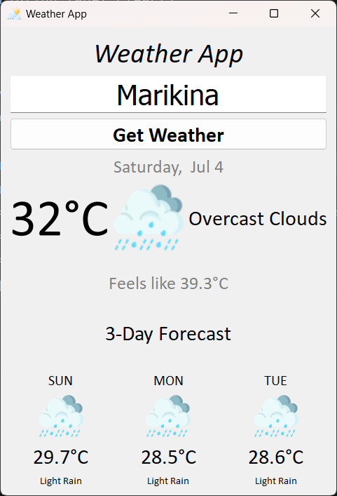

# 🌦️ Weather App

A modern desktop weather application built with **Python** and **PyQt5** that provides real-time weather information and a 3-day forecast using the OpenWeather API.


---

## 📸 Screenshot

> 

```
screenshots/weather_app.png
```

---

## ✨ Features

- 🌍 Search weather by city name
- 🌡️ Current temperature
- 🌡️ "Feels Like" temperature
- ☁️ Current weather condition
- 🖼️ Weather icons
- 📅 Current date
- 📆 3-Day weather forecast
- 📊 Daily average temperature calculation
- 🌦️ Representative weather condition for each forecast day
- 🖥️ Clean and responsive PyQt5 user interface

---

## 🛠️ Built With

- Python 3.13
- PyQt5
- Requests
- OpenWeather API

---

## 📦 Installation

### 1. Clone the repository

```bash
git clone https://github.com/yourusername/weather-app.git
cd weather-app
```

### 2. Create a virtual environment (Optional)

```bash
python -m venv venv
```

Activate it:

**Windows**

```bash
venv\Scripts\activate
```

**macOS/Linux**

```bash
source venv/bin/activate
```

### 3. Install the required packages

```bash
pip install -r requirements.txt
```

---

## 🔑 OpenWeather API Key

Create a free account at:

https://openweathermap.org/

Generate an API key and place it inside your project:

```python
api_key = "YOUR_API_KEY"
```

---

## ▶️ Run the Application

```bash
python main.py
```

---

## 📁 Project Structure

```
Weather-App/
│
├── icons/
│   ├── clear.png
│   ├── rain.png
│   ├── snow.png
│   ├── clouds.png
│   └── ...
│
├── screenshots/
│   └── weather_app.png
│
├── main.py
├── requirements.txt
├── README.md
└── LICENSE
```

---

## 🧠 What I Learned

This project helped me practice:

- Working with REST APIs
- Parsing JSON data
- PyQt5 GUI development
- Layout management
- Object-Oriented Programming
- Error handling
- Working with dictionaries and lists
- Date and time formatting
- Data processing and averaging
- Git and GitHub workflow

---

## 📈 Future Improvements

- [ ] Search history
- [ ] Dark mode
- [ ] Weather by GPS location
- [ ] Hourly forecast
- [ ] Sunrise and sunset information
- [ ] Humidity and wind speed
- [ ] Settings window
- [ ] Save last searched city

---

## 📄 License

This project is licensed under the MIT License.

---

## 👤 Author

**Giovanni Bielza**

GitHub: https://github.com/Giwithx